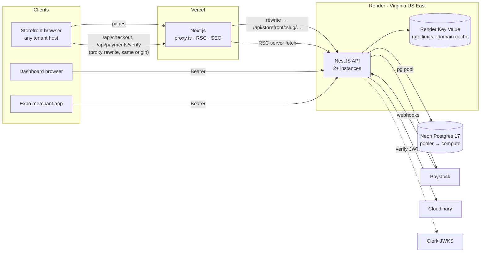

# Backend Migration Plan — NestJS API

> **Status: proposed. Nothing below is built.** Written 2026-09-14 against the
> code as it stands, not from memory. Every endpoint, rule and number below was
> read from this repository or from the live Neon project.

Move every piece of server business logic out of the Next.js app and into a
standalone NestJS service that the web storefront, the web dashboard and the
Expo merchant app all call. Do it without a single broken checkout, a leaked
tenant, or a mobile build that stops parsing.

---

## The short version

| Question | Decision |
| --- | --- |
| Where does the backend live? | A new `api/` NestJS app beside `custom_ecommerce_build/`, `mobile/` and `packages/core/`. The web app does not move. |
| How does it talk to the database? | **Prisma 7 + `@prisma/adapter-pg`, unchanged**, through Neon's **pooled** endpoint with an explicitly sized pool. Migrations keep using the direct endpoint, and run from the API pipeline only. |
| Where does it run? | **Render** (decided 2026-09-15): a web service in Render's **Virginia (US East)** region, the region nearest Neon's aws-us-east-1. At least two instances. |
| How do we avoid breaking things? | Strangler cutover. Nest serves the **same `/api/*` contract**; the web app flips endpoints to it one group at a time with rewrites; the payment path moves last. A contract parity suite has to pass against both implementations before each flip. |
| What does Next.js keep? | Rendering, `proxy.ts` hostname routing, Clerk session UI, SEO. **No database URL, no Paystack or Cloudinary secret.** |
| Rough size | ~5–6 engineer-weeks, in seven phases. |

**Git — done 2026-09-14.** The workspace root is now a repository with a
baseline commit (`461ec2b`) and remote `github.com/NazaAdimoha/Trevaly`
(public). The push is waiting on the owner authenticating as `NazaAdimoha`; the
SSH key and saved HTTPS login on the development machine belong to other GitHub
accounts. Follow-up fixes are on `fix/audit-followups`.

---

## Part 1 — What exists today

### Shape of the system

One Next.js 16 app on Vercel does four jobs at once:

1. **Marketing site**: `app/(marketing)`, with no Clerk.
2. **Multi-tenant storefront**: `proxy.ts` classifies the hostname and rewrites
   into `app/sites/[tenant]/**`. Server Components read the catalogue straight
   from Postgres.
3. **Merchant and platform dashboard**: `app/(platform)/dashboard/**`, behind
   Clerk. Server Components authorize, and client views call `/api/*` with the
   session cookie.
4. **The API**, for the dashboard's client views, the storefront's checkout,
   Paystack's webhooks, Vercel Cron, and the Expo app (Bearer token).

Around it:

- **`packages/core`**: pure TypeScript shared by web and mobile. It holds the
  Zod contracts, validation, variant pricing, order transitions, money, CSV and
  hostname classification. It has no Node built-ins, which a script enforces.
- **Database**: Neon project `multi-tenant-commerce`, **Postgres 17,
  aws-us-east-1, a fixed 0.25 CU compute** (min = max). The 512 MB branch limit
  suggests the Free plan. The app uses Prisma 7 with the `prisma-client`
  generator and the `pg` driver adapter. Runtime uses the pooled `-pooler` host;
  migrations use the direct host. There are 12 models and 6 migrations.
- **Third parties**: Paystack (subaccount split, initialize, verify, webhooks),
  Cloudinary (signed direct uploads, fetch-by-URL on import) and Clerk
  (identity only). A Resend key is configured, but **no email is sent anywhere**.

### Inventory — every piece of server logic that has to move

37 HTTP operations across 24 API route files, 20 Server Components and route
handlers that query the database directly, and one database lookup inside
`proxy.ts`. (36 / 23 / 19 when this plan was written. The additions are
`GET /api/platform/webhook-events` and its page, whose only database read is the
`requirePlatformAdmin` role check.)

#### A. The money path (highest blast radius)

| Operation | Auth | What it does | Called by |
| --- | --- | --- | --- |
| `POST /api/checkout` | Public; tenant from `x-tenant-slug` set by proxy | Re-prices every line from the DB, including variants. Validates the delivery zone and coupon; a rejected coupon gets the one uniform `COUPON_NOT_APPLICABLE` message whatever the reason. Increments `orderSequence` and creates the order in one transaction. Snapshots the platform fee. Calls Paystack initialize, and cancels the order if that fails. Rate limit: 8/min per IP per tenant. | Storefront checkout |
| `POST /api/payments/verify` | Public, reference only | `verifyAndFulfillOrder()`; 202 when not yet verifiable | Order confirmation page |
| `POST /api/webhooks/paystack` | HMAC-SHA512 over the **raw** body | Persists a `WebhookEvent` first (upsert on provider + event id). Handles `charge.success`, `charge.failed`, `refund.processed`, `charge.dispute.create` and `charge.dispute.resolve`. Returns **500 on failure** so Paystack retries. | Paystack |
| `GET /api/cron/expire-orders` | `CRON_SECRET` bearer | Cancels PENDING orders more than 24h old with no `paymentVerifiedAt` | Vercel Cron, daily 03:00 |
| `POST /api/coupons/preview` | Public; 10/min | Uniform valid/invalid answer via `publicCouponRejection` (core) — the same function checkout uses | Storefront checkout — the coupon field's **Apply** button |

#### B. Store admin — every call goes through `authorizeStore(slug)`

| Resource | Operations | Logic worth naming |
| --- | --- | --- |
| Overview | `GET` | `getStoreOverview` with `week/month/all/custom` windows and deltas. Revenue counts PAID + SHIPPED + DELIVERED. |
| Products | `GET list`, `POST`, `GET/PATCH/DELETE :id` | `isOwnedBy` on image public IDs; category ownership check; `variantRejectionReason`. The variant diff **retires** variants that appear on an order and **deletes** the rest. A P2003 on delete becomes 409 "mark inactive". |
| Import | `POST` | Preview by default and write only on `commit: true`. Max 500 rows. Creates categories first, has Cloudinary fetch each image URL, and captures errors per row. Rate limit: 6/min. |
| Categories | `GET`, `POST`, `PATCH/DELETE :id` | Delete returns the orphaned product count; P2002 → 409 |
| Coupons | `GET`, `POST`, `PATCH/DELETE :id` | Delete is refused once the coupon has been used |
| Delivery zones | `GET`, `POST`, `PATCH/DELETE :id` | Delete returns the orphaned order count |
| Orders | `GET list`, `GET/PATCH :id` | Search by name, email, phone or order number. Status changes follow `@core/orders`, and **PAID can never be set by hand**. |
| Settings | `GET`, `PATCH` | `logoBelongsToStore`; returns `logoUrl` built with `cloudinaryUrl` |
| Upload signature | `GET`, `POST` | Signs only allowlisted params (`folder`, `timestamp`). The folder must be one of the tenant's own. `allowed_formats` is enforced. Rate limit: 30/min. |

#### C. Identity and platform

| Operation | Auth | Notes | Called by |
| --- | --- | --- | --- |
| `GET /api/app/config` | Public | Minimum-version gate and feature flags; `Cache-Control: public, max-age=60, s-maxage=300` | Mobile |
| `GET /api/me/stores` | Signed in | Memberships with `storefrontUrl` and `logoUrl` | Mobile |
| `GET /api/platform/banks` | SUPER_ADMIN | Paystack bank list, de-duplicated by code; `Cache-Control: private, max-age=3600` | Onboarding form (client fetch) |
| `GET /api/platform/tenants` | SUPER_ADMIN | Tenant estate, with `storefrontUrl` resolved by `tenantOrigin` | Tenants list at `/dashboard/platform/tenants` |
| `GET /api/platform/webhook-events` | SUPER_ADMIN | Webhook deliveries with per-status counts. **Never returns `payload`** (shopper email, card metadata). | Webhook events page |
| `POST /api/platform/tenants` | SUPER_ADMIN | Resolve account (a 429 is tolerated) → create subaccount → **only then** write the Tenant | Onboarding form |

#### D. Database reads outside `/api` — the part that is easy to miss

| Where | What it reads |
| --- | --- |
| `src/proxy.ts` → `resolveHostname` | Custom domain → slug, with an LRU cache (5 min positive, 30 s negative, failures never cached) |
| `app/sites/_tenant.ts` | Public tenant by slug, wrapped in React `cache()` |
| Storefront layout, home, category, product, checkout, order confirmation, `sitemap.xml`, `robots.txt` | Tenant, categories, products + variants (first 60), delivery zones, order by reference, sitemap slugs |
| Dashboard layout | The signed-in user's `PlatformUser` role |
| Dashboard home | `listMyStores` |
| Platform tenants, webhook events, onboarding pages | `requirePlatformAdmin` role check only — the tenant list and bank list now come from the API |
| Store layout and the overview, product detail, product edit, settings, coupons and delivery-zones pages | `requireTenantMember`, `getStoreOverview`, product by id, `tenantOrigin` |

#### Who calls what

| Client | Transport today | Endpoints |
| --- | --- | --- |
| Web dashboard (client views) | Same-origin axios + Clerk cookie | Products, import, categories, coupons, delivery zones, orders list/detail/PATCH, settings, upload signature, platform tenants GET/POST, platform banks, platform webhook events |
| Storefront browser | Same-origin axios, tenant from hostname | `checkout`, `payments/verify`, `coupons/preview` |
| Mobile app | `Authorization: Bearer <Clerk token>` + `X-App-Version` | `app/config`, `me/stores`, `overview`, `orders` list/detail/PATCH, `products` list/POST, `settings` GET/PATCH, `uploads/signature` |
| Paystack | Signed POST | `webhooks/paystack` |
| Vercel Cron | Bearer `CRON_SECRET` | `cron/expire-orders` |

### The invariants — the "nothing breaks" list

A test must show each of these still holds in Nest before its endpoint takes
traffic. They come from `AGENT.md`, the security audit and the code itself.

1. **Tenant isolation is structural.** `tenantDb()` injects `tenantId` into
   filters, stamps it on creates, and guards unique operations with an
   ownership check that throws `CrossTenantAccessError` → 404. Nested creates
   still set `tenantId` explicitly.
2. **Membership is a database check against the slug in the URL.** Any
   `PlatformUser` (SUPPORT included) acts as OWNER on any store. Platform
   routes require SUPER_ADMIN (403). A store the caller cannot see is **404,
   not 403**.
3. **The server prices everything.** Payment is initialized server-side, so the
   browser only ever holds an opaque `access_code`.
4. **Fulfillment has exactly one implementation**, and it keeps every guard:
   - Verify status, reference, amount and currency.
   - The `PENDING → PAID` claim is a conditional `updateMany`.
   - Stock decrements are conditional, on the variant when the line has one.
   - `PlatformEarning` uses `createMany` with `skipDuplicates`.
   - The coupon increment is raw SQL with the `maxUses` guard.
   - A stock shortfall still marks the order PAID and sets `hasStockIssue`.
5. **Webhooks**: verify the raw body with `timingSafeEqual`, persist before
   processing, upsert on `(provider, providerEventId)`, return 500 on failure,
   and store "No …" notes in `error`.
6. **Refunds accumulate** and `REFUNDED` is set only when fully refunded. A
   dispute is a flag, not a status. `charge.failed` only touches PENDING orders.
   **Stock is never restored.**
7. **Upload signing** keeps its allowlist, derives the folder from the tenant,
   and `isOwnedBy` still guards every stored public ID.
8. **Order transitions** come from `@core/orders`, and no path sets PAID by hand.
9. **Onboarding order**: Paystack succeeds before any row is written.
10. **Rate limits** keep their keys and numbers: checkout 8, coupon 10, import
    6 and upload signing 30 per 60 s.
11. **The wire contract is additive-only**:
    - Same paths, status codes and field names.
    - Errors are `{ error, issues? }`, with the per-endpoint message.
    - Decimals serialize as strings and dates as ISO strings.
    - Product DELETE returns 204.
    - The mobile app parses every response with Zod.
12. **The public order page stays tenant-scoped** and never exposes an
    unmasked customer email.

---

## Part 2 — Target architecture



### Who owns what afterwards

| Layer | Owns |
| --- | --- |
| **`api/` (NestJS)** | All reads and writes, every business rule, the Prisma schema and migrations, Paystack/Cloudinary/cron secrets, webhook handling, rate limiting, scheduled jobs, and anything added later (push, order email). |
| **`custom_ecommerce_build/` (Next.js)** | Rendering. `proxy.ts` hostname routing, including the header sanitizing. Clerk session UI and `auth().getToken()`. Canonicals and structured data, themes, the cart. |
| **`packages/core`** | Same role. It also gains the Zod schemas that live inline in route files today (delivery zones, coupon update, order update and list query, import, signature request), so Nest validates with the exact schemas the clients use. |
| **`mobile/`** | Unchanged apart from its base URL. |

### Repository layout

```
custom-ecommerce/
  custom_ecommerce_build/   web — stays where it is (MOBILE_PLAN: "the web app did not move")
  mobile/
  api/                      NEW — NestJS
    prisma/                 schema.prisma + migrations, moved byte-for-byte
    prisma.config.ts
    src/
  packages/core/
```

### How requests reach Nest, per client

**Storefront browser → same-origin proxy rewrite.** Only two endpoints are
called from the storefront browser (checkout and verify; nothing calls coupon
preview yet). `proxy.ts` already knows the tenant from the hostname, so it
rewrites `/api/checkout` on a tenant host to
`${API_ORIGIN}/api/storefront/{slug}/checkout`.

- **Why not direct CORS:** tenants have arbitrary custom domains, so the CORS
  allowlist would need its own database lookup, and the browser would be
  exposed to a second origin for no gain.
- **Why the slug goes in the path:** a header that Nest had to trust would need
  the same "inbound value is always hostile" defence `proxy.ts` has today. A
  slug in the path is public input, treated as such, and validated (ACTIVE,
  subaccount present) on every call. That is exactly the exposure a tenant
  hostname has now.

**Dashboard browser → direct, with a Bearer token, at the end.** One static
CORS origin (`https://{ROOT_DOMAIN}`). During the migration it keeps calling
same-origin `/api/*`, which gets rewritten; Phase 6 switches it.

**Mobile → direct, with a Bearer token.** The first App Store build should
already point at the API host (`api` is in `RESERVED_SUBDOMAINS`, so
`api.{ROOT_DOMAIN}` can never resolve as a storefront). Until then it reaches
Nest through the web host's rewrites, which it cannot tell apart.

**Server Components → server-to-server `fetch`.** A new server-only
`src/lib/server-api.ts` in web forwards `auth().getToken()` as a Bearer token
for dashboard reads and sends nothing for storefront reads. For parity, use
`cache: 'no-store'`: the storefront reads Postgres on every request today, and
changing freshness during a migration hides regressions. Tag-based caching is a
follow-up (Part 8).

### Endpoints that do not exist yet

Everything in Part 1 keeps its path, with two exceptions: storefront checkout
and the expiry job. Their only callers are `proxy.ts` and the scheduler, both of
which we control. The rest of the list is new, because web can no longer reach
the database itself:

| New endpoint | Replaces |
| --- | --- |
| `GET /api/me` → `{ userId, platformRole }` | Dashboard layout's `PlatformUser` read; `requirePlatformAdmin` |
| `GET /api/stores/:slug` → tenant summary, role, `storefrontUrl` | `requireTenantMember` in the store layout and pages |
| `GET /api/storefront/:slug` | `resolveStorefrontTenant` (public branding subset plus the canonical fields) |
| `GET /api/storefront/:slug/catalog?category=` | Home and category grids |
| `GET /api/storefront/:slug/products/:productSlug` | Product page and its metadata |
| `GET /api/storefront/:slug/delivery-zones` | Checkout page |
| `GET /api/storefront/:slug/orders/:reference` | Order confirmation. Returns the **masked** email only, so the audit fix cannot regress over the wire. |
| `GET /api/storefront/:slug/sitemap` | `sitemap.xml` data |
| `POST /api/storefront/:slug/checkout` | `POST /api/checkout` (the slug moves from header to path) |
| `GET /api/internal/domains/:hostname` (internal key) | `resolveCustomDomain` in `proxy.ts` |
| `GET /api/jobs/expire-orders` (`CRON_SECRET`) | `GET /api/cron/expire-orders` |

---

## Part 3 — Connecting to the database

This is the decision the rest of the plan rests on, so the reasoning is laid
out in full.

### 3.1 Keep Prisma 7. Do not change the data layer during this move.

| Option | Verdict | Why |
| --- | --- | --- |
| **Prisma 7 + `@prisma/adapter-pg`** (today's stack) | **Chosen** | The 6 migrations, their `_prisma_migrations` checksums, the `tenantDb` extension and its real-database isolation test all come along untouched. Every query ports line for line, so review becomes a diff and not a re-derivation. |
| TypeORM (Nest's traditional pairing) | Rejected | Every query and the whole tenant-isolation layer would be rewritten. Entities would have to be reconciled against migrations Prisma already owns. |
| Drizzle / Kysely | Not now | Good tools, but rewriting the fulfillment claim and tenant scoping *while* changing runtime doubles the risk on the two things that must not break. They can be revisited later, one module at a time, if Prisma ever blocks something. |
| `@prisma/adapter-neon` (serverless driver) | Rejected | Built for edge and serverless runtimes without long-lived TCP. A container should hold a normal `pg` pool. |

**Module format.** Nest compiles to CommonJS by default. The installed Prisma
7.9.1 `prisma-client` generator accepts `moduleFormat = "cjs"` (verified in
`node_modules`), so the API gets its own generator block instead of
reconfiguring Nest for ESM:

```prisma
generator api {
  provider     = "prisma-client"
  output       = "../src/generated/prisma"
  moduleFormat = "cjs"
}

// Transitional — deleted in Phase 6, when web stops touching the database.
generator web {
  provider = "prisma-client"
  output   = "../../custom_ecommerce_build/src/generated/prisma"
}
```

One schema, two outputs, each inside the root of the app that consumes it.
`pnpm sync:core` keeps copying enums into `packages/core` from either output.

### 3.2 Pooled endpoint for runtime, direct endpoint for migrations

Today's split stays, for new reasons.

**Why a long-running server still uses the pooler:**

- **The coexistence window.** For several weeks, Vercel functions *and* Nest
  instances share one 0.25 CU compute. Neon sizes `max_connections` from
  compute size (roughly 100 at 0.25 CU; check Neon's connection-limits table
  for the exact figure). The `pg` pool's default `max` is 10 *per instance*,
  so a burst of concurrent Vercel instances plus two Nest instances could
  exhaust direct connections. The pooler accepts up to 10,000 client
  connections and multiplexes them.
- **Rolling deploys** briefly double the Nest instance count.
- **Nothing in the code needs a session.**
  - Interactive `$transaction` is safe in transaction mode, because the
    connection is pinned for the length of the transaction.
  - `$executeRaw` is one parameterized statement.
  - There is no `LISTEN/NOTIFY`, no session advisory lock and no `SET`.

**The rule that keeps it safe:** any future feature that needs session state
must scope it to a transaction. That means `SET LOCAL` (for example, if
row-level security is added later) and `pg_advisory_xact_lock`, never the
session variants. Put this in `AGENT.md`.

**Size the pool explicitly** instead of inheriting the default:

```ts
new PrismaPg({
  connectionString: env.DATABASE_URL, // the -pooler host
  max: env.DB_POOL_MAX,               // start at 10 per Nest instance
  idleTimeoutMillis: 30_000,
  connectionTimeoutMillis: 5_000,
});
```

Budget: `(Nest instances × DB_POOL_MAX) + (peak web instances × web pool max)`
must stay under what the pooler can open to the compute. During coexistence,
lower web's pool `max` to 2–3. Web's traffic shrinks as endpoints move, and it
reaches zero in Phase 6.

**Migrations** keep `DIRECT_URL` (PgBouncer in transaction mode cannot run
them), run only from the API's pipeline (`prisma migrate deploy`), and run
before the API deploy that needs them.

### 3.3 Put Nest in the same region as the database

The database is in **aws-us-east-1**. Nest runs on **Render** (owner's
decision, 2026-09-15) in Render's **Virginia (US East)** region, the nearest of
its five (Oregon, Ohio, Virginia, Frankfurt, Singapore).

A Lagos user's trip to the API happens once per request. The API's trip to the
database happens once per *query*. A checkout issues about ten queries plus a
transaction, and a cross-region hop of 100–200 ms on each would add more than a
second. Vercel's default function region (`iad1`) is also US East, so
Server Component → API calls stay close.

**Verify the database round trip before creating production services.**
Render's docs do not say which cloud or data centre backs each region, so
"nearest" is an inference, not a guarantee — and Render does not allow changing
a service's region after it is created. In Phase 1, deploy a throwaway service
in Virginia that runs `SELECT 1` against Neon's pooled endpoint 200 times and
reports p50/p95. Expect single-digit milliseconds; if it is tens, stop and
reconsider before anything permanent is built there.

**What Render provides for the requirements below** (from Render's docs):

| Requirement | On Render |
| --- | --- |
| At least 2 instances, health-checked rolling deploys | Manual or auto scaling. With several instances Render deploys one at a time, and cancels and reverts the whole deploy if a new instance fails its health check. Set `healthCheckPath: /api/health` — a readiness check that touches Postgres and Key Value, not just the port. |
| Migrations from the API pipeline only | **Pre-deploy command** `prisma migrate deploy` (runs after the build, before instances roll, on a separate instance). Paid instance types only. Migrations still have to be backward compatible (3.5), because the old instances keep serving while it runs. |
| Graceful shutdown | `maxShutdownDelaySeconds` in `render.yaml`, with Nest's `enableShutdownHooks()` draining requests and closing the `pg` pool. |
| Redis in-region | **Render Key Value** in Virginia, on the region's private network. Services in different regions cannot use it privately. |
| Scheduled jobs | A **Render Cron Job** calling `/api/jobs/expire-orders` replaces Vercel Cron in Phase 4 step 5. |
| Infrastructure as code | A `render.yaml` Blueprint in the repo for the API, Key Value and cron. |
| Request timeout of **120 s or more** (a 500-row import that fetches images through Cloudinary runs synchronously today) | **Verify in Phase 1** — not confirmed from Render's docs. If it is shorter, the import moves to a background worker before Phase 3. |

Postgres traffic goes Render → Neon over the public internet with TLS
(`sslmode=require`); Neon is not on Render's private network.

### 3.4 Neon plan and compute

The project runs a fixed 0.25 CU and looks like the Free plan, where the
compute scales to zero when idle. That is acceptable for staging. **Before
Phase 4 moves real payments**:

- Move to a paid plan.
- Enable autoscaling (for example 0.25–2 CU).
- Disable scale-to-zero on the production branch, so the first checkout after a
  quiet night does not pay a compute cold start.

### 3.5 Schema ownership while two codebases share one database

- **One schema, owned by the API.** Move `prisma/` into `api/prisma/` with the
  migration files unchanged; their checksums are recorded in the database.
  Afterwards `prisma migrate status` against production (read-only) must
  report nothing pending and no drift.
- **Expand/contract only** while two codebases read the same tables. Add
  columns nullable or defaulted, and add tables freely. Never rename or drop
  anything until every reader is gone. This is the additive-only rule
  `core/api/contracts.ts` already applies to the wire, applied to the schema.
- **Neon branches per environment:**
  - `staging`, reset from production, for parity and E2E runs.
  - Short-lived per-PR branches for the tenant-isolation suite, which writes
    real rows.
  - A `dev` branch for local Nest.

### 3.6 Tenant isolation inside Nest

- `DatabaseModule` exports a singleton `PrismaService` (one client, one pool)
  and a `tenantDb(tenantId)` factory, ported from `src/lib/tenant-db.ts`
  unchanged. Each extension shares the base client and pool and is cheap to
  create.
- **Do not inject the tenant with `Scope.REQUEST` providers.** In Nest that
  makes every dependent provider request-scoped, so they are rebuilt on every
  request.
- Instead, `StoreMemberGuard` resolves the tenant and attaches it to the
  request, and a `@CurrentStore()` decorator passes it to the controller. The
  controller hands `tenant.id` to services.
- **Carry the lint guard over.** In `api/`, ESLint `no-restricted-imports`
  bans `PrismaService` under `modules/stores/**`, `modules/catalog/**` and
  `modules/storefront/**`, with the same inline-disable-plus-justification
  convention as today.
- Port `tenant-isolation.test.ts` before any tenant-scoped endpoint.
- Row-level security as defence in depth is a sound later addition, and it fits
  transaction pooling via `SET LOCAL`. It is **not** part of this migration.

---

## Part 4 — The Nest application

### Module map

```
api/src/
  main.ts                 rawBody: true · trust proxy · global prefix "api" · CORS allowlist
  config/                 Zod-parsed env; the process refuses to boot on a bad config
  database/               PrismaService · tenantDb() · Prisma error → HTTP mapping
  auth/                   ClerkAuthGuard · StoreMemberGuard · PlatformAdminGuard · InternalKeyGuard
                          @CurrentUser() · @CurrentStore()
  common/                 ZodPipe(schema, message) · ApiExceptionFilter · RateLimitGuard (Redis) · client-ip
  integrations/
    paystack/             ported paystack.ts
    cloudinary/           signer · uploadFromUrl
  modules/
    identity/             GET /me · GET /me/stores
    app-config/           GET /app/config
    platform/             banks · tenants (list + onboarding)
    stores/               GET /stores/:slug · settings · overview
    catalog/              products (+ variants) · categories · import · uploads/signature
    promotions/           coupons · coupon evaluation shared by preview and checkout
    delivery/             delivery zones
    orders/               admin list · detail · status
    checkout/             POST /storefront/:slug/checkout
    payments/             FulfillmentService (verifyAndFulfillOrder) · verify · webhook · event handlers
    storefront/           public reads for SSR · coupon preview · internal domain resolution
    jobs/                 expire-orders
```

Services keep the names of the functions they replace:
`FulfillmentService.verifyAndFulfillOrder`, `WebhookEventsService.applyRefund`,
`OverviewService.getStoreOverview`. Anyone reading `AGENT.md` can then find the
new home of every rule by searching for the old name.

### Nest defaults that would silently change behaviour

Each needs an explicit decision, and the parity suite checks every one.

| # | Nest default | Today | Do this |
| --- | --- | --- | --- |
| 1 | Errors are `{ statusCode, message, error }` | `{ error: string, issues? }`; web's `handleApiError` and mobile's `toApiError` both read `.error` | A global `ApiExceptionFilter` emits the current shape, and unknown errors become `{ error: 'Something went wrong' }` with status 500 |
| 2 | class-validator DTOs | Zod schemas from `@core`, shared with the clients | A `ZodPipe(schema, 'Invalid product')` that keeps each endpoint's message ("Invalid coupon", "Invalid delivery zone", …); no DTO classes |
| 3 | JSON body parsed before the handler | The webhook HMAC covers the **raw bytes** | `NestFactory.create(AppModule, { rawBody: true })`; the webhook reads `req.rawBody`. Re-serialized JSON fails the signature, and **every webhook would return 401** |
| 4 | `POST` returns 201 | Checkout, verify, preview, import and signature return 200 (verify can also return 202 or 404); resource creates return 201; product DELETE returns 204 | `@HttpCode()` on every route, with no reliance on defaults |
| 5 | `ClassSerializerInterceptor` in many templates | Plain `JSON.stringify` (Decimal → `"1.00"`, Date → ISO) | Return plain objects and register no serializer |
| 6 | A redirect or HTML on auth failure (common in Passport setups) | 401 JSON; store 404; platform 403 | Verify Clerk sessions with the official Express SDK (`@clerk/express`), which accepts both the Bearer header and the `__session` cookie. Guards throw, never redirect. **Corrected in Phase 1:** do *not* set Clerk's `authorizedParties`. In `@clerk/backend` 3.17.2 it rejects any token with no `azp` claim, and the Expo app's tokens have none, so every merchant would be signed out of the app. Web does not set it either. `ClerkAuthGuard` instead refuses a token whose `azp` names an origin outside `CLERK_AUTHORIZED_PARTIES`, and accepts a token with no `azp` as web does. |
| 7 | Throttler storage in memory | In memory per serverless instance (audit finding 8, open) | A Redis-backed fixed window with the same keys and limits, **which closes finding 8** |
| 8 | `req.ip` is the load balancer | Leftmost `x-forwarded-for`, trusted because Vercel overwrites it | Set `trust proxy` to the host's real hop count. For requests that arrive through the Vercel rewrite, see Phase 4's IP check. |
| 9 | No cache headers | `app/config` and `banks` set `Cache-Control` | Set the same headers explicitly |
| 10 | `req.hostname` is the API's host | Checkout's Paystack `callback_url` uses the **storefront origin** the customer is on | `proxy.ts` forwards the original host. Nest accepts it only if it is this tenant's subdomain or its verified custom domain, and otherwise falls back to `tenantOrigin(tenant)`. |
| 11 | Scheduled jobs run on every instance | One Vercel Cron call | Keep a single external scheduler — a Render Cron Job — calling `/api/jobs/expire-orders`. The job is idempotent, but running it once is simpler to reason about than a cron on each instance. |

### Auth, precisely

- **`ClerkAuthGuard`**: no valid session → `401 { error: 'Not signed in' }`.
  Verification runs inside the guard, not as global `clerkMiddleware`. Global
  middleware would put the identity provider in front of the Paystack webhook
  and the health check, so a Clerk outage could fail payment webhooks and pull
  healthy instances out of rotation.
- **`StoreMemberGuard`** reproduces `authorizeStore()` exactly:
  1. Look up a `TenantUser` by `clerkUserId` and the `:storeSlug` param.
  2. Failing that, **any** `PlatformUser` acts as `OWNER` on an existing store.
  3. Otherwise return `404 { error: 'Store not found' }`.
- **`PlatformAdminGuard`**: SUPER_ADMIN only, otherwise `403 { error: 'Forbidden' }`.
- **`InternalKeyGuard`**: a shared secret between `proxy.ts` and Nest, used
  only for internal domain resolution and for trusting a forwarded client IP.
  It is never used to decide which tenant a request is for.

---

## Part 5 — The migration, phase by phase

Each phase has an exit criterion that must be met before the next begins. Every
flip is a web deploy, so **rollback is Vercel's instant rollback**. The old
route handlers stay deployed until Phase 6.

### How an endpoint is flipped

`beforeFiles` rewrites run **before** filesystem routes (verified in the Next
16 docs in `node_modules`), so a rewrite overrides an existing route handler
without touching it:

```js
// next.config.js — the list grows one group per phase
async rewrites() {
  const api = process.env.API_ORIGIN;
  const moved = (process.env.NEST_ROUTES ?? '').split(',').filter(Boolean);
  return {
    beforeFiles: moved.map((source) => ({
      source,                               // e.g. '/api/stores/:slug/categories/:path*'
      destination: `${api}${source}`,
    })),
  };
}
```

Storefront endpoints move inside `proxy.ts` instead, because they need the
hostname-derived slug placed in the path.

### Phase 0 — Safety net · ~3 days

1. ~~**Put the workspace under git.**~~ **Done 2026-09-14** — baseline
   `461ec2b`; push pending owner authentication.
2. **Create a Neon `staging` branch** and point a staging deploy of the current
   web app at it.
3. **Build the contract parity suite** (Part 6.1) and run it green against the
   *current* Next app. It is the definition of "unchanged".
4. **Run the Playwright checkout suite green** on staging.
5. **Declare the freeze.** Until Phase 6, `verify-order.ts`,
   `webhook-events.ts`, the webhook route and the checkout route change only in
   both codebases at once, in the same PR.

**Exit:** a git baseline; parity and E2E green against Next on staging.

### Phase 1 — Nest foundation · ~1 week

- Scaffold `api/` with `config/`, `database/` (pooled, explicit pool), `auth/`,
  `common/`, a health endpoint, structured logs with request ids, and Redis.
- Resolve `@core/*` from source in both the build and the test runner. (This
  is the sixth tool to learn the alias; `MOBILE_PLAN` records the other five.)
  The build is `tsc` + `tsc-alias`, not `nest build`: the Nest 12 CLI needs
  Node ≥ 22.22.3.
- Move `prisma/` into `api/prisma/` with the two generator blocks, then confirm
  `prisma migrate status` reports no drift against production.
- Move the inline route schemas into `packages/core`. While doing it, reconcile
  the two coupon update schemas: the route's allows `minOrderKobo` and the
  core's does not.
- Replace web's 16 imports of `@/generated/prisma/enums` with `@core/enums`.
  This removes web's build-time dependency on Prisma generation early.
- Port `tenantDb` and `tenant-isolation.test.ts`, and run them on a Neon branch.
- Add a `render.yaml` Blueprint: the API web service (Virginia, 2 instances,
  `healthCheckPath`, pre-deploy `prisma migrate deploy`,
  `maxShutdownDelaySeconds`), a Key Value instance, and the cron job.
- Measure the Render Virginia → Neon round trip (3.3) **before** creating the
  production service, and confirm Render's request timeout.
- Deploy to staging on Render and ship `GET /api/app/config`.

**Exit:** isolation test green in `api/`; `app/config` passes parity; staging
has two instances behind a health check; the measured p95 database round trip
is recorded here.

#### Phase 1 progress — 2026-09-15

**Done and verified locally** (branch `fix/audit-followups`):

| Item | Evidence |
| --- | --- |
| `api/` on Nest 12 + Express 5, CommonJS, `@core` compiled from source | `tsc` clean; build output starts |
| `config/`: Zod env, refuses to boot | Production without `REDIS_URL` exits 1 listing the setting name only. A blank `KEY=` counts as unset. |
| `database/`: pooled `PrismaService`, ported `tenantDb` | Diff against web's `tenant-db.ts` is the added `prisma` parameter only |
| `prisma/` moved to `api/prisma/`, two generators | `migrate status`: up to date, 7 migrations, no drift. Web still passes tsc, tests, build and lint. |
| `common/`: `ApiException`, `ApiExceptionFilter`, `ZodPipe`, request id + JSON logs | `test/app.test.ts` |
| `auth/`: the three guards, `@CurrentUser`, `@CurrentStore` | `test/guards.live.test.ts` against **real Clerk sessions** (member, non-member, SUPER_ADMIN; sessions revoked afterwards); `clerk-auth.guard.spec.ts` for the `azp` rule |
| Tenant isolation ported | `test/tenant-isolation.test.ts`, all 12 assertions, real database |
| `GET /api/health` (readiness) | 200 when healthy; **503** with Key Value unreachable |
| `GET /api/app/config` | **Byte-identical body** and identical `Cache-Control` to the running Next route. Only difference: `Content-Type` adds `; charset=utf-8`. |
| Unauthenticated store route | Web and Nest both return `401 {"error":"Not signed in"}`, with no token and with a forged one |
| `render.yaml` | Build script run on a clean copy with no `node_modules`, generated client or `dist`; started with Render's start command; health 200 |

The API suite (43 tests) passed three consecutive runs.

**Found while building — changes to this plan:**

1. **`authorizedParties` would lock out the mobile app.** Part 4, row 6, above.
2. **Render cannot build from `rootDir: api`.** Render's monorepo docs: "Files
   outside your service's root directory are not available to the service at
   build time or at runtime." The API compiles `packages/core`, so the Blueprint
   builds from the repo root and uses `buildFilter` paths for monorepo scoping.
3. **Render's default Node for new services is 24.14.1.** With no version
   pinned, it reads the first `package.json` it finds in a subdirectory.
   `render.yaml` pins `NODE_VERSION=22.22.0`, the major the API is tested on.
   `engines` now has an upper bound.
4. **Nest's default JSON body limit is body-parser's 100 KB**, and a 500-row
   import with descriptions is larger. Web's route handlers have no limit. Set
   to 2 MB, and an oversized body now returns `413 {error}`, not a 500.
5. **The first database connection must happen at boot.** From a cold pool,
   TLS plus waking Neon took longer than the health check's 2-second budget, so
   a healthy new instance would fail its first check mid-deploy. `PrismaService`
   now connects before the app listens, retrying up to three times.
6. **Connection resets were invisible.** The pg adapter keeps a dropped
   connection from crashing the process but reports it only to `debug`. The
   API now logs both callbacks, and TCP keepalive is on.

**Still open in Phase 1:**

- Move the inline route schemas into `packages/core` and reconcile the two
  coupon update schemas.
- Replace web's imports of `@/generated/prisma/enums` with `@core/enums`.
- **Needs the owner's Render account:** create the Blueprint, deploy staging,
  measure the Virginia → Neon p50/p95 (3.3), and confirm Render's request
  timeout.
- **Verify `TRUST_PROXY_HOPS=1` on Render** with a request that echoes
  `req.ip` and `x-forwarded-for`. It is inferred, not documented. If it is
  wrong, rate limits key on the load balancer's address.
- Set `autoDeployTrigger` to `checksPass` once CI exists (Phase 0).

### Phase 2 — Read-only endpoints · ~4 days

`app/config`, `me/stores`, `GET /me` (new), `GET /stores/:slug` (new),
`overview`, product list and detail, categories, coupons, delivery zones, order
list and detail, settings, platform banks and platform tenants (GET).

Flip them in three groups: identity, catalogue, then orders and settings.
Point the mobile app at staging and use all four screens.

**Exit:** parity green; the mobile app is fully usable against staging;
48 hours in production with no increase in 5xx or p95 latency on the moved
paths.

### Phase 3 — Admin writes · ~1 week

Categories, coupons, delivery zones, settings, order status PATCH, products
POST/PATCH/DELETE including the variant retire-or-delete diff, upload
signature, CSV import and tenant onboarding.

- **Upload signature:** re-run every probe in `SECURITY_AUDIT.md`'s
  verification table against Nest.
- **Import:** run a real 500-row commit with image URLs through the production
  load balancer and confirm it finishes inside the timeout. The per-row writes
  mean a timeout leaves a *partial* import behind.
- **Onboarding:** test-mode Paystack only, and confirm no Tenant row is written
  when subaccount creation fails.

**Exit:** parity and audit probes green; a manual dashboard walkthrough covers
every form.

### Phase 4 — The money path · ~1 week including soak

Ordered so that each step can be rolled back independently.

1. **Coupon preview.** Port it (the checkout Apply button calls it now), and
   move coupon evaluation into one `promotions` service shared with checkout.
   Keep `publicCouponRejection` as the only thing either returns to a shopper.
2. **Checkout and verify.** `proxy.ts` rewrites `/api/checkout` to
   `${API_ORIGIN}/api/storefront/{slug}/checkout` and `/api/payments/verify` to
   Nest. Before the flip, confirm the real client IP reaches Nest through a
   Vercel external rewrite. If it does not, `proxy.ts` stamps `x-client-ip`
   with the internal key, and Nest trusts it only when the key matches.
   Otherwise every shopper shares one rate-limit bucket.
3. **Webhook, test mode.** Point the Paystack test-mode webhook URL at Nest,
   then run the full E2E suite, a refund and a dispute.
4. **Webhook, live mode.** Change the live webhook URL, then place one real
   low-value transaction and refund it.
5. **Scheduled job.** Create the Render Cron Job for `/api/jobs/expire-orders`
   and remove the cron from `vercel.json`.

**Why the two implementations can safely overlap.** Idempotency lives in the
**database**, not in either codebase:

- The `PENDING → PAID` claim is a conditional `updateMany`.
- `PlatformEarning.orderId` is unique, and inserts use `skipDuplicates`.
- `WebhookEvent` is unique on `(provider, providerEventId)`.

So a browser verify handled by Next and a webhook handled by Nest can race on
the same order and still fulfill it exactly once. The only condition is that
the two implementations are identical, which is what the Phase 0 freeze
guarantees.

**Rollback:** point the webhook URL back (the Next handler is still deployed),
then replay any `WebhookEvent` rows marked `FAILED`.

**Watch for 72 hours:**

- `WebhookEvent` rows with status FAILED, and 401s on the webhook path.
- PENDING orders older than one hour.
- Orders with `hasStockIssue`.
- Checkout 4xx and 5xx rates.

**Exit:** the M6 E2E criteria pass against Nest; one live transaction is paid,
fulfilled and refunded correctly; 72 hours with no FAILED webhook events.

### Phase 5 — Server Components and `proxy.ts` · ~1 week

- Add `src/lib/server-api.ts` (server-only). `resolveStorefrontTenant` keeps
  its React `cache()` wrapper around a fetch.
- Port the storefront layout, home, category, product, checkout, order
  confirmation, `sitemap.xml` and `robots.txt`. Keep
  `dynamic = 'force-dynamic'` on the two route handlers, per `AGENT.md`.
- Port the dashboard: `requireTenantMember` calls `GET /stores/:slug` (401 →
  sign-in redirect, 404 → `notFound()`); `requirePlatformAdmin` calls `GET /me`;
  overview calls `/stores/:slug/overview`. This reverses the documented choice
  in `overview.ts` for Server Components to call the function directly. That
  was right while a database was in reach, and the point it protected, one
  definition of revenue, still holds in Nest.
- Point `proxy.ts` custom-domain resolution at `GET /api/internal/domains/:host`,
  keeping the same LRU (5 min / 30 s / failures never cached). Subdomains still
  resolve with zero lookups, so an API outage cannot take a subdomain storefront
  offline at the routing step.
- Compare Lighthouse scores on a storefront product page before and after.

**Exit:** `grep` finds no `@/lib/prisma`, `tenant-db`, `auth-api`,
`payments/{paystack,verify-order,webhook-events}`, `media/cloudinary` or
`stores/overview` import anywhere in web; web builds and runs **with
`DATABASE_URL` unset**.

### Phase 6 — Decommission · ~3 days

- Delete web's `app/api/**` handlers and the server libraries above, then
  delete the `web` generator block.
- **Remove secrets from web's environment**: `DATABASE_URL`, `DIRECT_URL`,
  `PAYSTACK_SECRET_KEY`, `CLOUDINARY_API_SECRET`, `CLOUDINARY_API_KEY` and
  `CRON_SECRET`. A compromised web deploy then yields neither the database nor
  the payment account.
- Switch the dashboard's axios instance to `API_ORIGIN` with a Bearer token
  from Clerk's `getToken()`. Drop the `/api/stores`, `/api/platform` and
  `/api/me` entries from `isClerkRoute`.
- Keep the web host's `/api/*` rewrites only while a mobile build that calls the
  web host is still installed. Raise `minimumVersion` in `/app/config` to retire
  them; that gate exists for exactly this.
- Ban `@prisma/*`, `pg` and `@/generated/prisma/*` in web's ESLint config.
- Rewrite `AGENT.md`'s Multi-Tenant, Payments and Key Files sections for the new
  layout. The Key Files table already points at three files that moved to
  `packages/core` (`variants.ts`, `csv.ts`, `reserved.ts`).

**Exit:** web holds no server secrets; parity and E2E pass with web's API
handlers deleted.

---

## Part 6 — How we prove nothing broke

1. **Contract parity suite (new, and the backbone of this plan).** For every
   endpoint, send the same request to the old and new implementations on the
   Neon staging branch and compare status, key headers and the JSON body with
   ids and timestamps normalized. Cover the error paths too:
   - a 409 slug clash
   - a cross-tenant id → 404
   - a used coupon delete → 409
   - an illegal status transition → 409 with `allowed`
   - rate-limit 429 with `Retry-After`
   - signed out → 401, non-member → 404, SUPPORT user → OWNER on stores but
     403 on platform
2. **Existing tests move with their code.** The eight pure Vitest suites follow
   their modules. `webhook-events.test.ts` (refund arithmetic) and
   `tenant-isolation.test.ts` (real database) move to `api/`.
3. **Webhook replay from real history.** Every event Paystack has ever sent is
   already stored in `WebhookEvent.payload`. Re-sign those payloads with the
   test secret and replay them against Nest on staging to get real-world
   payload shapes for free.
4. **A concurrency test for the overlap window.** Fire a Next verify and a Nest
   webhook at one order simultaneously. Assert exactly one stock decrement, one
   `PlatformEarning` row, one coupon use and one PAID transition.
5. **Playwright E2E, unchanged.** It already resolves real tenant hostnames and
   goes through `proxy.ts`, so it exercises the rewrite path exactly as
   production does.
6. **Security audit probes**: the signature allowlist, the folder boundary and
   `allowed_formats`, re-run against Nest.
7. **Mobile**: `npm run typecheck` and `npm run bundle:check`, plus a manual
   pass of all four screens against staging. The app's Zod parsing surfaces any
   response drift as a named field.

---

## Part 7 — Risk register

| Risk | What it would cost | Mitigation |
| --- | --- | --- |
| Raw body lost before the webhook | Every webhook returns 401; orders paid in a closed tab stay PENDING | `rawBody: true`; replay real payloads (6.3); alert on webhook 401s |
| The two fulfillment implementations drift during overlap | Double stock decrements or missed fulfillment | Phase 0 freeze; database-level idempotency; concurrency test (6.4); keep Phase 4 short |
| Connections exhausted on 0.25 CU | 500s for every tenant at once | Pooled endpoint, explicit pool sizes, a lower web pool during overlap, autoscaling before Phase 4 |
| Error or status shape drifts | Wrong toasts on web; mobile shows "the server sent something this app did not expect" | Global filter, `@HttpCode` everywhere, parity suite, mobile Zod |
| A service uses raw `PrismaService` for tenant data | A cross-tenant leak, the worst failure this product has | Ported `tenantDb`, ESLint ban, isolation test, guard tests |
| Wrong client IP behind the rewrite | Shoppers share one checkout bucket (sales blocked), or limits are bypassed | Verify in Phase 4.2; stamped IP behind the internal key; test from two IPs |
| The API is down | Storefront SSR fails (it fails today if the database is down); checkout fails | 2+ instances, health checks, alerting; later, cached catalogue reads (Part 8) |
| Custom-domain lookup adds a hop | Slower first hit per domain per instance | The LRU stays in `proxy.ts`; subdomains need no lookup |
| Paystack callback lands on the API host | Customers on the redirect flow see a JSON page | Forward and validate the storefront origin (Part 4, row 10) |
| Import exceeds the load-balancer timeout | A partially imported catalogue | Timeout of 120 s or more; verify in Phase 3; a background job later |
| Nest far from the database | Checkout slows by more than a second | Render Virginia beside Neon's us-east-1, with the round trip measured before the region is committed (it cannot be changed later) |

---

## Part 8 — What the backend makes possible afterwards

Out of scope for the migration and listed so nobody sneaks them in, but each
becomes straightforward once Nest exists:

- **Cached storefront reads.** `fetch` with `next: { revalidate, tags }`, plus
  Nest calling a web revalidation endpoint on catalogue writes. Checkout
  re-checks stock anyway, so a cached grid can be slightly stale safely.
- **Push notifications (MOBILE_PLAN Phase 4) and order email** (the Resend key
  is already configured). Write an outbox row *inside* the fulfillment
  transaction and deliver it asynchronously: "a push failure must never fail a
  fulfillment."
- **Background CSV import**: return a job id and poll it, as an additive
  contract change.
- **Record a sale** (`docs/RECORD_A_SALE.md`) lands in the `orders` module and
  reuses the same conditional stock decrement.
- **Postgres row-level security** as a second tenant-isolation layer, using
  `SET LOCAL` inside transactions.

---

## Part 9 — Noticed while reading (not blockers)

Status as of 2026-09-14. Fixes are on branch `fix/audit-followups`.

| # | Finding | Status |
| --- | --- | --- |
| 1 | **Store sidebar → Orders 404'd.** No orders page existed under `app/(platform)`, so orders were manageable only from the phone. | **Fixed.** `/dashboard/stores/:slug/orders` and `/orders/:id` — search, status and needs-attention filters, pagination, status changes from `nextStatuses`, internal note, and the dispute / refund / stock-issue / failed-payment banners. Status dialogs state what the change does *not* do (no transition moves money). |
| 2 | **Operator sidebar — both links 404'd** (Tenants, Webhook Events). Not in the original list; found while fixing #1. | **Fixed.** Tenants list moved to `/dashboard/platform/tenants` (where the sidebar pointed; `/dashboard/platform` redirects). New `/dashboard/platform/webhook-events` over a new `GET /api/platform/webhook-events`. `navigation.test.ts` now fails if any sidebar link has no page. |
| 3 | **Three endpoints had no caller.** | **Fixed by giving them callers**, not by deleting them — the end state of this plan is a Next.js with no database URL and no Paystack secret, so these are the copies that survive. `coupons/preview` → checkout's Apply button (shoppers now see the discount before Paystack opens). `platform/tenants` GET → tenants list (it duplicated the page's server query exactly). `platform/banks` → onboarding form, fetched client-side; the page no longer calls Paystack. |
| 4 | **Checkout was a coupon oracle.** | **Fixed.** `publicCouponRejection` + `COUPON_NOT_APPLICABLE` in `packages/core/src/validation/coupon.ts`, used by both checkout and preview. "Below minimum" is uniform too — otherwise a one-item cart enumerates live codes. Verified against the running app: five failure kinds (nonexistent, expired, used up, inactive, below minimum) → one identical response from each endpoint. |
| 5 | **`invalidateDomain` in settings PATCH did nothing useful.** | **Removed**, with a comment saying why. The domain cache holds hostname → slug only; the route cannot change either; the storefront reads the tenant through per-request React `cache`, so name and logo changes are live on the next request. If the route ever changes `slug` or `customDomain`, invalidation belongs there — and needs Redis to reach every instance. |
| 6 | **Money displayed 100× too small** on delivery areas (₦1,500 fee shown as ₦15.00) and coupons (₦500 off shown as ₦5.00). `formatCurrency` takes kobo; both pages divided by 100 first. Stored values were correct. Found while wiring the checkout discount. | **Fixed.** `money-usage.test.ts` fails on any `formatCurrency(... / 100)`, and was checked against the baseline commit to confirm it catches both. |
| 7 | **A payment that lands on a cancelled order was silently dropped.** `verifyAndFulfillOrder` returned early for any order that was not PENDING. Paystack still captured and settled the money; nothing was recorded. Reachable when a merchant cancels a PENDING order, or when `expireStaleOrders` cancels one after 24 h and a slow bank transfer confirms later. | **Fixed — record and flag** (owner's decision, 2026-09-15). The order stays CANCELLED; the payment is recorded (`paidAmountKobo`, `paymentVerifiedAt`), `paidAfterCancellation` is raised, and the platform earning is written. No stock taken, no coupon use counted. Handled on both paths — the early return and the race where a cancellation lands between read and claim. A full refund clears the flag. Surfaced in the web and app order screens, the needs-attention filter and overview count, the app's notifications, and the customer's confirmation page ("Your payment went through"). Verified with a real Paystack test-mode charge on a cancelled order, plus the full E2E suite. |
| 8 | **Duplicate coupon update schemas**, as noted in Phase 1. | Open — Phase 1. |

---

## Part 10 — Decisions for you

Answered by the owner on 2026-09-14: "yes to all the decisions".

1. **Nest host** in us-east-1: whichever of Railway, Render, Fly or AWS
   ECS/App Runner the team will actually operate. The requirements are in 3.3.
   **Decided 2026-09-15: Render**, Virginia (US East) region. See 3.3 for what
   that means and the latency check to run first.
2. **Neon plan upgrade**, autoscaling and no scale-to-zero, before Phase 4.
   **Approved.**
3. **Redis provider**: Upstash, or the host's managed Redis.
   **Approved: whichever is in-region with the API** — so **Render Key Value**
   in Virginia.
4. **Storefront transport**: a same-origin proxy rewrite, or direct CORS.
   **Approved: the rewrite** (Part 2).
5. **First mobile store build targets the API host directly.**
   **Approved.**
6. **Late payment on a cancelled order** (Part 9 #7): **record and flag**
   (decided 2026-09-15; implemented).

---

## Part 11 — Applying `BACKEND_OPTIMIZATIONS.md`

The workspace-root folder `BACKEND_OPTIMIZATIONS.md/` holds chapter notes on
rate limiting, payment systems, scaling, notifications, digital wallets and
maps. (Their `./images/*.png` references point at files that are not in the
folder.) What each means for this plan, stated against what the code does today:

### Rate limiter

| Practice | Here today | Action |
| --- | --- | --- |
| Centralised counter store (Redis) | Per-process `Map`. On serverless the effective limit is the configured limit × warm instances, and it resets on cold start. | **Phase 1:** move `lib/rate-limit` to Render Key Value before running two Nest instances. |
| Sliding-window counter | Fixed-window style `Map` | Implement the sliding-window counter atomically (Lua or `INCR` + `EXPIRE` in one `MULTI`). |
| Tell clients when to retry | `Retry-After` on 429 already | Add `X-RateLimit-Remaining`. |
| Key on the real client | IP + tenant | The `x-client-ip` stamping in Phase 4 step 2, or every shopper behind the rewrite shares one bucket. |
| Monitor | Nothing | Count 429s per route; alert on spikes on checkout and preview. |

### Payment system

| Practice | Here today | Action |
| --- | --- | --- |
| Exactly-once via unique constraints | **Yes.** `WebhookEvent` upsert on (provider, event id), unique `PlatformEarning.orderId`, conditional PENDING → PAID claim. | Port unchanged (Phase 4). |
| Idempotency key on the pay-in request | **No.** A double submit or a refresh creates a second PENDING order and Paystack transaction. | Add `Idempotency-Key` to `POST /checkout` in the Nest port, stored with a unique constraint. |
| Retry queue + dead-letter queue | Paystack retries on our 500; FAILED rows are kept. **Now visible** at `/dashboard/platform/webhook-events`. | **Phase 4:** an operator *replay* action on a FAILED event (safe because fulfilment is idempotent). |
| Nightly reconciliation against the PSP | **None.** | **New, Phase 4 exit:** compare Paystack transactions and settlements with Orders and PlatformEarnings; flag mismatches. It is the backstop for Part 9 #7 and for any webhook that never arrived. |
| Handle slow payments with a pending state | Yes — the confirmation page's `pending` state. | Keep. Note the 24 h sweep assumes transfers confirm within a day; reconciliation should check before cancelling. |
| Double-entry ledger | Not needed. We never hold funds; Paystack splits at settlement. | None — see Digital wallet. |

### Scaling

| Practice | Here today | Action |
| --- | --- | --- |
| Stateless web tier | The rate limiter and the domain LRU are per-instance memory. | Both into Redis before horizontal scaling (Phase 1–2). This is also why settings PATCH can never invalidate the domain cache correctly from one instance. |
| Cache with expiry and a consistency plan | Domain cache: 5 min positive, 30 s negative, failures never cached. | Keep the TTLs in Redis; invalidate on domain attach/detach. |
| CDN for static assets | Cloudinary delivers every image. | None. |
| Database replication | Single Neon primary. | After Phase 5, consider a Neon read replica for storefront reads. |

### Notification system — for MOBILE_PLAN Phase 4 (push)

| Practice | Action |
| --- | --- |
| Deduplicate | Notification log keyed on (order id, event type), so a webhook redelivery never notifies twice. |
| Retry with backoff; keep failures | Queue sends; record provider errors; drop dead device tokens. |
| Respect the user | Per-merchant opt-out and quiet hours. |
| Send outside the money transaction | Already required by MOBILE_PLAN; never inside the fulfilment transaction. |

### Not applicable, deliberately

- **Digital wallet** (event sourcing, TC/C, sagas): the platform holds no
  balance. Adopting a wallet would contradict the architecture and the
  marketing site's central promise.
- **Maps**: delivery zones are named areas with flat fees. Geocoding an address
  to suggest a zone is a possible later feature, not part of this migration.
